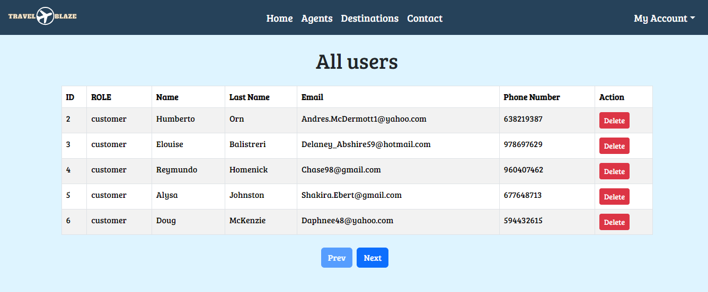

<h1 align="center">  
</h1>

<details>
  <summary>Content 📝</summary>
<ol>
  <li><a href="#objective">Objective</a></li>
  <li><a href="#features">Features</a></li> 
  <li><a href="#technologies-used">Technologies Used</a></li>
  <li><a href="#installation-instructions">Installation Instructions</a></li>
  <li><a href="#endpoints">Endpoints</a></li>
  <li><a href="#future-functionalities">Future Functionalities</a></li>
  <li><a href="#acknowledgements">Acknowledgements</a></li>
  <li><a href="#contact">Contact</a></li>
</ol>
</details>

## Objective

The aim of this initiative is to create a refined and professional frontend application that seamlessly interacts with our API, specifically engineered to oversee the operational aspects of a travel agency's business model. This application endeavors to provide a comprehensive range of views and functionalities customized for users, agents, and administrators alike.

## Features

<details>
<summary>User Features</summary>
🔐 Seamless Registration: Users can effortlessly register and input their details to set up an account.

<p align="center">
  
</p>

🔑 Login: Easily access your account through a user-friendly login procedure, ensuring swift and convenient access to all functionalities.

<p align="center">
  
</p>

📝 User Profile Editing: Made an error during registration? Fear not, users have the power to seamlessly modify their information at their convenience.

<p align="center">
  
</p>

🗓️ Appointment Management: Manage your schedule efficiently with an intuitive appointment system, allowing seamless booking, rescheduling and cancelling.

<p align="center">
  
</p>

🌍✈️Explore Travel Agents Extraordinaire: Immerse yourself in our curated selection of travel agents.

<p align="center">
  
</p>

🗓️ Delve into Detailed Bookings: Users can explore their bookings in depth, ensuring a seamless travel experience.

<p align="center">
  
</p>

</details>
<details>
<summary>Agent Features</summary>

📅 Appointment Management: Artists can effortlessly view their scheduled appointments along with detailed information about the users they are scheduled with.

<p align="center">
  
</p>

📝 Booking Creation: Agents can easily create new bookings for travelers.

<p align="center">
  
</p>


</details>
<details>
<summary>Superadmin Features</summary>

👤 User Management: Empowering the Superadmin with comprehensive oversight, enabling them to seamlessly navigate through all user profiles and efficiently manage user accounts, including the ability to remove users when necessary.

<p align="center">
  
</p>


📋 Booking Oversight: Empowered with comprehensive insights, the Superadmin can meticulously review booking details and swiftly remove bookings when necessary, fostering streamlined control and system optimization.

<p align="center">
  
</p>

🚀 Agent Onboarding: The Superadmin wields the authority to seamlessly onboard new agents onto the platform, enabling the expansion of our elite team of travel experts and ensuring unparalleled service excellence.

<p align="center">
  
</p>

🗓️ Appointment Management: The Superadmin can effortlessly oversee all appointments, ensuring seamless organization and facilitating quick decision-making. They also have the authority to delete appointments as needed, streamlining the scheduling process.

<p align="center">
  
</p>

</details>

## Technologies Used

<p align="left"> <a href="https://www.w3schools.com/css/" target="_blank" rel="noreferrer">  </a> <a href="https://git-scm.com/" target="_blank" rel="noreferrer">  </a> <a href="https://www.w3.org/html/" target="_blank" rel="noreferrer">  </a> <a href="https://developer.mozilla.org/en-US/docs/Web/JavaScript" target="_blank" rel="noreferrer">  </a> <a href="https://www.mysql.com/" target="_blank" rel="noreferrer">  </a>  <a href="https://reactjs.org/" target="_blank" rel="noreferrer">  </a> <a href="https://redux.js.org" target="_blank" rel="noreferrer">  </a>  <a target="_blank" rel="noopener noreferrer" href="https://github.com/devicons/devicon/blob/master/icons/git/git-original.svg"></a>
<a target="_blank" rel="noopener noreferrer" href="https://github.com/devicons/devicon/blob/master/icons/bootstrap/bootstrap-plain.svg"></a 
</p>

## Installation Instructions

1. **Clone the Repository:**

   ```bash
   git clone https://github.com/GabrielEscudillo/TravelBlaze-FrontEnd
   cd travelblaze-frontend
   ```

2. **Install Frontend Dependencies:**

   ```bash
   npm install
   ```

3. **Configure the Backend:**

   - Begin by creating a MySQL database.
   - Follow the backend installation instructions provided in the [TravelBlaze-Backend](https://github.com/GabrielEscudillo/TravelBlaze-Backend).

4. **Install Backend Dependencies:**

   ```bash
   npm install
   ```

5. **Start the Application:**
   - Navigate to the frontend directory and run `npm run dev` to start the frontend.
   - Similarly, in the backend directory, execute `npm run dev` to initiate the backend server.

The application will be accessible via [http://localhost:5173/](http://localhost:5173/) for the frontend and [http://localhost:3000/](http://localhost:3000/) for the backend.

Explore freely and let your imagination run wild with TravelBlaze!
<!-- ## Endpoints -->

## Future Functionalities

- **Users**


📧 Confirm Email: Authenticate your account via email confirmation, boosting security and thwarting unauthorized entry.

🔍 Password Retrieval: Effortlessly regain access to your account by following a simplified procedure for password recovery, guaranteeing uninterrupted login.

🌟 Booking Modification Requests: Users will have the ability to request modifications to their bookings directly through the website, offering greater flexibility and convenience.

- **Agents**

🗓️ Appointment Editing: Empower agents to modify appointments, enabling them to efficiently manage their schedules.

📝 Booking Data Modification: Provide agents with the capability to update booking information, ensuring accuracy and flexibility in managing travel arrangements.

🛤️ Way Functionality: Introduce a new feature that allows agents to seamlessly navigate through the booking process, enhancing their efficiency and productivity.

- **SuperAdmin**


🚀 Tailored Feature Development: Customize and adjust platform functionalities to align with specific business demands and objectives, fostering adaptability and scalability.

🔧 Platform Upkeep: Execute system enhancements, routine maintenance activities, and issue resolution to uphold the platform's seamless operation and performance.
## Acknowledgements

- I want to express my sincere appreciation for the collaboration and hard work of my esteemed colleagues [Erika Orlando](https://github.com/AkireOrl) and [Hector Soriano](https://github.com/HSoriano99). Throughout this journey, we upheld consistent communication, offering each other mutual support and guidance, cultivating a strong sense of teamwork and camaraderie.
Additionally, I'd like to extend my thanks to my instructor, Demian, whose invaluable guidance and support have played a crucial role in our collaborative efforts.


## Author

- **Gabriel Escudillo**

## Contact

<div align="center">
<a href = "gabrielescudillo@gmail.com"  target="_blank">

</a>
<a href="https://github.com/GabrielEscudillo"  target="_blank">
    
</a>  
<a href="https://www.linkedin.com/in/gabriel-escudillo-b8b436134/" target="_blank">

</a>
</div>
